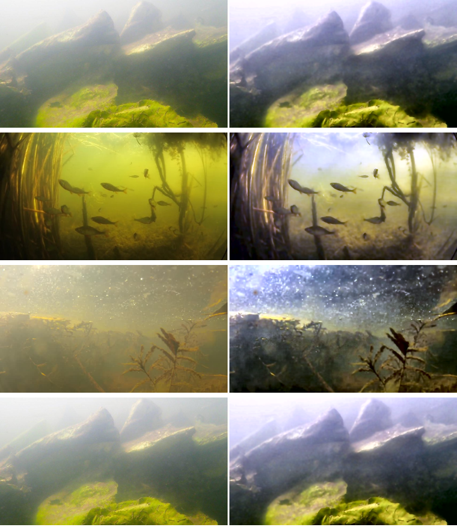
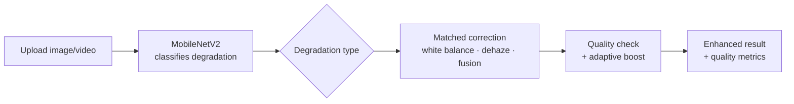

# 🌊 AquaVision — Underwater Image & Video Enhancement

[](https://github.com/thribhuvan003/AquaVision-Web/actions/workflows/ci.yml)


Underwater photos come out blue-green, hazy, and washed out — water absorbs red
light and scatters the rest. **AquaVision restores them.** Upload an image or
video and it figures out *how* the image is degraded, then applies the matching
correction to bring back natural colour, contrast, and detail.

It runs entirely on the **CPU** with classical computer-vision methods plus one
small neural network — no GPU, no paid AI API.

**🔗 Live demo:** _coming soon (Hugging Face Spaces)_

---

## Before / after



_Left: original underwater image. Right: AquaVision output._

---

## What it does

- **Smart correction** — a small **MobileNetV2** model classifies each image into
  one of 9 degradation types (blue tint, green tint, haze, low light, blur, …) and
  routes it to the enhancement settings that fit.
- **Classical enhancement pipeline** — white balance, red-channel recovery,
  dark-channel dehazing, CLAHE contrast, and multi-scale fusion (Ancuti et al.).
- **Video support** — enhances videos frame by frame in the background, with live
  progress you can poll while it runs.
- **Batch mode** — enhance many images at once and download them as a zip.
- **REST API** — enhance images programmatically with a Bearer-token key.
- **Accounts** — register/log in (passwords are hashed), personal gallery, API dashboard.

---

## Does it actually work? (measured results)

Numbers are produced by the reproducible harness in [`benchmark/`](benchmark/) —
not hand-picked. Run it yourself with `python -m benchmark.run`.

**No-reference** (real underwater photos, 36 images — higher is better):

| Metric | Original | Enhanced | Change |
|---|---|---|---|
| UCIQE | 23.16 | **31.33** | **+8.17** |
| UIQM  | 2.03  | 1.82      | −0.21  |

**Full-reference** (clean photo → simulated underwater → enhance → compared to the
original, 12 images — higher is better):

| Metric | Degraded input | Enhanced output | Change |
|---|---|---|---|
| PSNR (dB) | 9.97 | **13.53** | **+3.57** |
| SSIM      | 0.704 | **0.748** | **+0.044** |

Enhancement clearly improves colour quality (UCIQE) and restoration accuracy
(PSNR/SSIM). UIQM dips slightly — reported honestly rather than hidden, since
colour correction and that metric's sharpness term can pull in opposite directions.

---

## How it works



The classifier picks the strategy; the classical pipeline does the restoration; a
quality check re-runs with stronger settings if the first pass barely changed the image.

---

## Run it locally

Requires **Python 3.10+**.

```bash
git clone https://github.com/thribhuvan003/AquaVision-Web.git
cd AquaVision-Web

python -m venv .venv && source .venv/bin/activate   # Windows: .venv\Scripts\activate

# CPU-only PyTorch (smaller, no CUDA download)
pip install torch torchvision --index-url https://download.pytorch.org/whl/cpu
pip install -r requirements.txt

cp .env.example .env          # set SECRET_KEY (any random hex string)
python app.py                 # serves on http://127.0.0.1:5000
```

> Video enhancement uses `imageio-ffmpeg` (bundled). For best results you can also
> install system `ffmpeg`, but it isn't required to start the app.

---

## Tests

```bash
pip install -r requirements-dev.txt
pytest          # 16 tests: routes, auth, pipeline, API, metrics
```

CI runs the full suite on every push (see the badge above).

---

## Project structure

```text
AquaVision-Web/
├── app.py                 # Flask app: routes, auth, enhancement pipeline, video, API
├── best_model.pth         # MobileNetV2 degradation classifier (~12 MB)
├── benchmark/             # Reproducible metrics harness (UIQM/UCIQE, PSNR/SSIM)
├── tests/                 # pytest suite
├── templates/             # Jinja2 HTML pages
├── static/                # CSS, JS, sample/uploaded media
├── Dockerfile             # Container build (used for deployment)
├── requirements.txt       # Runtime dependencies
├── requirements-dev.txt   # + test/benchmark dependencies
└── legacy_and_research/   # Archived experiments (an unused deep-learning pipeline, notebooks)
```

---

## Tech stack

**Python · Flask · PyTorch (MobileNetV2) · OpenCV · NumPy/SciPy · scikit-image · SQLite · Waitress · Docker**

---

## References

The enhancement methods are based on published work:

1. Ancuti et al. (2018) — *Color Balance and Fusion for Underwater Image Enhancement*
2. He et al. (2009) — *Single Image Haze Removal Using Dark Channel Prior*
3. Sandler et al. (2018) — *MobileNetV2: Inverted Residuals and Linear Bottlenecks*
4. Panetta et al. (2016) — *Human-Visual-System-Inspired Underwater Image Quality Measure (UIQM)*
5. Yang & Sowmya (2015) — *An Underwater Color Image Quality Evaluation Metric (UCIQE)*
